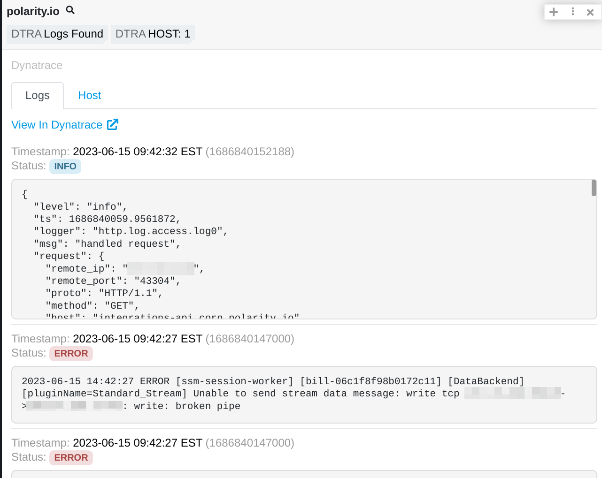
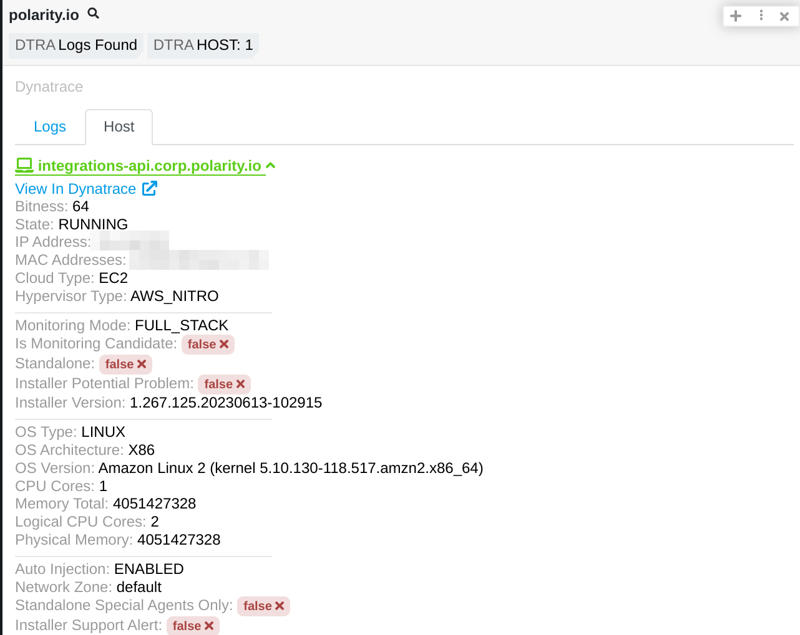
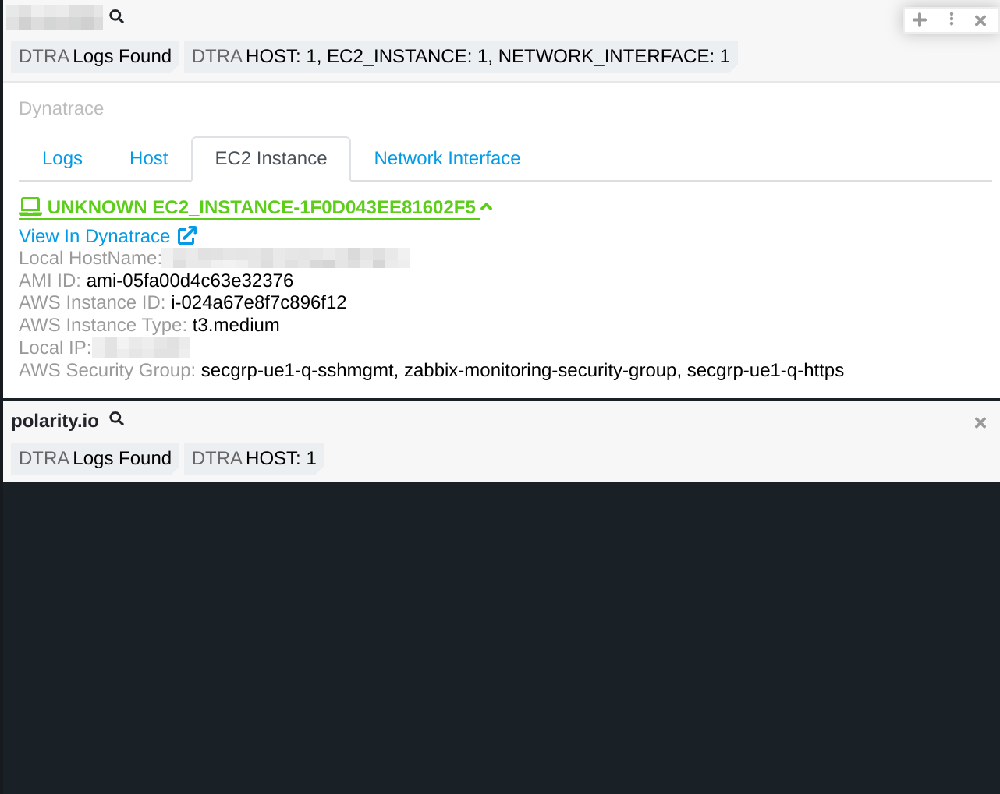
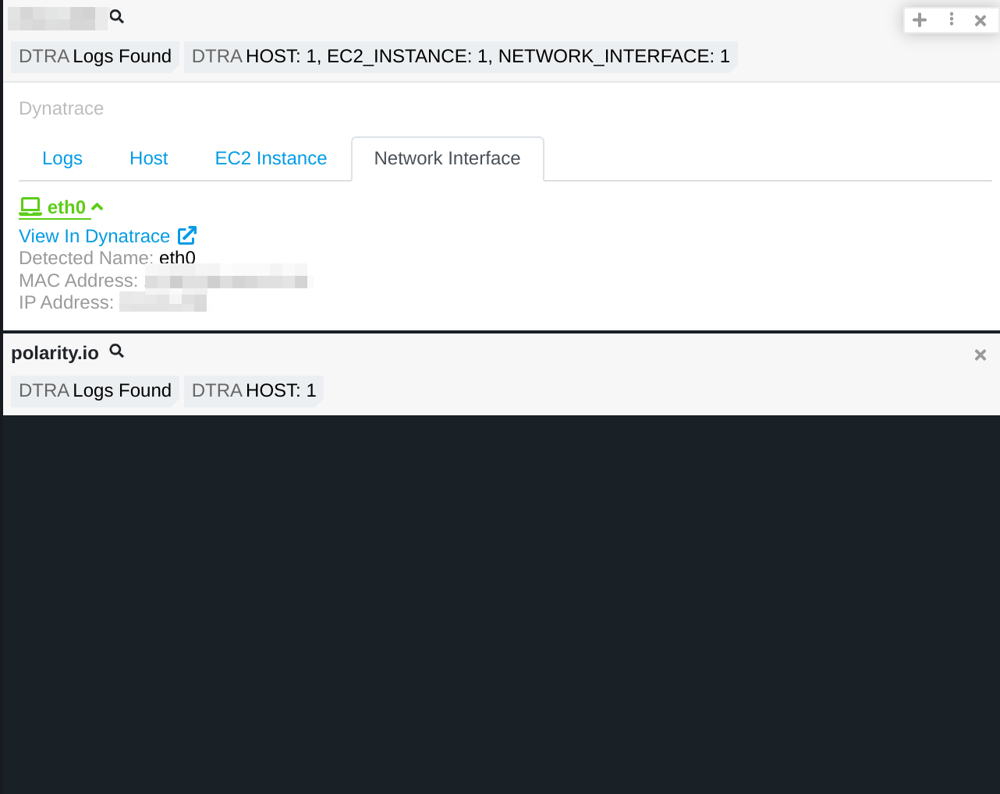

# Polarity Dynatrace Integration

## Dynatrace Integration Options

| ------------------------- | ------------------------- |
|  |  |
| ------------------------- | ------------------------- |
| _Dynatrace Logs Tab_ | _Dynatrace Host Tab_ |
| ------------------------- | ------------------------- |
|  |  |
| ------------------------- | ------------------------- |
| _Dynatrace EC2 Tab_ | _Dynatrace Network Tab_ |
| ------------------------- | ------------------------- |

### Dynatrace Environment ID

This can be found in the URL when logged into Dynatrace. For example, if the URL is https://abc123.live.dynatrace.com/#home, the environment ID is abc123.

### Dynatrace Password

Valid Dynatrace password corresponding to the username specified above. Leave this field blank is authenticating via a Dynatrace Authentication Token.

### Dynatrace Authentication Token

A Dynatrace Public Token which can be created from the Dynatrace web interface by going to "Manage -> Access tokens -> Generate new token". Make sure to include the correct scopes (ei. Read entities and Read Logs)

### Dynatrace Search String

Dynatrace Search Query to execute. The string `{{ENTITY}}` will be replaced by the looked up indicator. For example: `host.name:{{ENTITY}}` or `process_group_name:{{ENTITY}}`. If left blank, the search query will default to `host.name:{{ENTITY}}`.

## Installation Instructions

Installation instructions for integrations are provided on the [PolarityIO GitHub Page](https://polarityio.github.io/).

## Polarity

Polarity is a memory-augmentation platform that improves and accelerates analyst decision making. For more information about the Polarity platform please see:

https://polarity.io/
